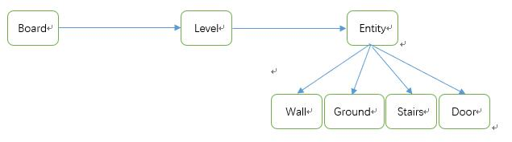
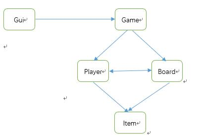

## The game's entry is locating at Src/gui/Menu.java class.

This project is a in-course project which using for practice MVC and other design pattern. 
In this project, student must understand GUI, Git, Object Oriented programming include encapsulation, abstraction, inheritance, and polymorphism. 

My main individual contribution to the project is the game map. I am primarily responsible for developing the board library. 
I also participate in other parts such as save & load and map design that is highly cohesive with board library.
For example, when I decide how to develop board library that I also need to think what this game map should be like. 
Because of this reason I take charge on these works.

First of all, as I have mentioned above that my main responsibilities are instantiation of Game map including the whole world of this game. 
Board library is the core library which will contain all the elements of this game, 
although some element such as item and character are not instantiation in the board library. 
But board library should provide capacity for other elements in this game. For example, player could interact on board. 

Secondly, we could see clearly that Board class is the main class of Board library. There are thirteen maps in this game and each map represents one level. 
The attribution of level is entity. In light to appreciation of normal human logic, we divide entity into four types each with unique functions. 
Wall includes breakable wall and unbreakable wall. Ground is the most significant class in the board library and it includes other components of our game. 
Stairs link to other levels. Door is differentiated by color.

There are four components in our game, GUI, Player, Item and Board. For the game logic there have a game class that will include player and board libraries as its field. 
Save & Load method will be instantiation in game class by using these fields. 

On one hand, the Gui library uses this class to interacts with board by get field in game class. In the section, I have illustrated that Board will have a class call ground. 
Ground includes item. According to normal human logic, item should be on the ground.
Same with monster, shop and temple. Monster, shop and temple are included in Character Library. 
By using this method I link my library to most parts of the Character library and the whole item library. 

On the other hand, the most significant class of Character library called “player” and is saved as field in Game class. 
Board library interacts with Player in the Game class and player input data to board library then board library will in turn return data for player to use. 
For example, if a player wants to move then he inputs coordinates to board then board will tell player whether he could move or not. 
Moreover, player passes pick item command to board library then board library processes the command and passes item to player class. 

Since there are many components in our game, it is significant that format each components name. 
We set a code name rule which is a combination of two integers for different components. 
For example, from 20 to 24 for different doors, from 90 to 99 set for monsters. 
The logic of ground class in board library that we have talked in last section which apply the aforementioned rule. 
There are many components that could be found on one ground and each ground can merely contain one thing. 
People usually choose multi-field to save these components. However, it will waste time on using these components. 
For example, when we want to get what contained in one ground then program will check each field and give answer. 
I think about one method to use one generic to implement this and other libraries or classes wanting to use this field. 
Thereby, we only need to cast and it could serve as a double check on code name for safety conerns. 
There are some methods like toString applying rule of Name code on build map and save & load. 

Furthermore, the abstract class Entity plays an important role in the whole library and uses protect type of field which is better than private type. 
Subclasses is capable of using superclass protect type field. 
When player picks up item from one ground then the ground should become normal ground that the code of ground should also become 00(normal ground code name). 
Encapsulation of a class is necessary so that for some method like initialization() set the type as private method.

After mulling over the whole project, Save & load could be improved. As I have mentioned in previous sections, we use rule of name code.
So our initialization depends on a format text file. The capacity of the text file now is small. 
however if people want to develop or enhance our game, making more maps, adding more feature then the text file will be enlarged. 
I think LZ77 algorithm could use in this case. The reason of choosing LZ77 is that name code is two integers instead of string Huffman coding cannot perform well in this case. 
Similarly, when the number of feature enlarges to a great size then people could use tries for that situation.
